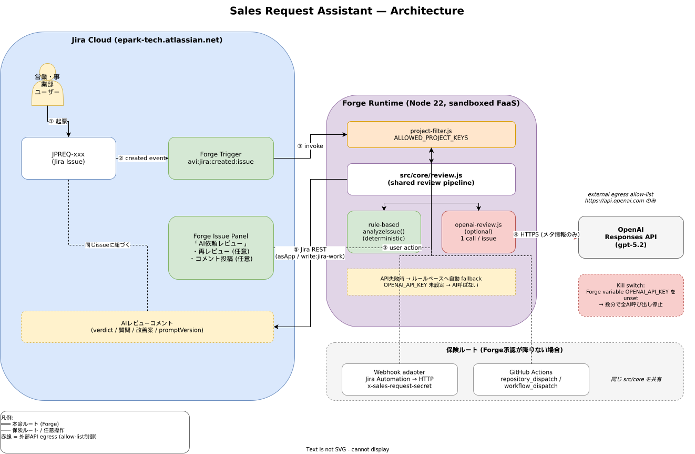

# アーキテクチャ概要

> 上長確認用資料 / 作成日: 2026-06-22
> 詳細な契約レベルの情報は `docs/architecture.md` を参照

## 1. ねらい

営業・事業部がJiraに依頼を起票したあと、**別UIに移動させずに**Jira上で「不足情報・質問・改善案」を受け取れる状態を作る。開発側の差し戻し往復を減らすのが目的。

## 2. 全体図



編集用ソース: [`diagrams/architecture.drawio`](diagrams/architecture.drawio) (VS Code Draw.io extension で編集可能)

<details><summary>テキスト版</summary>

```text
┌──────────────────────────────────────────────────────────────────────┐
│                              Jira Cloud                              │
│                                                                      │
│   営業・事業部                                                       │
│       │ ① 起票 (JPREQ-xxx)                                           │
│       ▼                                                              │
│   ┌─────────────────────────┐                                        │
│   │ Issue (JPREQ project)   │◀────────────────┐                      │
│   └─────────────────────────┘                 │ ⑤ AIレビューコメント │
│       │                                       │                      │
│       │ ② created event                       │                      │
│       ▼                                       │                      │
│   ┌──────────────────────┐                    │                      │
│   │  Forge Trigger       │                    │                      │
│   │  (本命ルート)         │                    │                      │
│   └──────────────────────┘                    │                      │
│       │                                       │                      │
│       │   ┌──────────────────────────────┐    │                      │
│       │   │  Forge Issue Panel            │   │                      │
│       │   │  「AI依頼レビュー」            │   │                      │
│       │   │  ・再レビュー (任意)           │   │                      │
│       │   │  ・コメント投稿 (任意)         │   │                      │
│       │   └──────────────────────────────┘    │                      │
│       │           │                            │                     │
│       └─────┬─────┘                            │                     │
│             ▼                                  │                     │
└─────────────┼──────────────────────────────────┼─────────────────────┘
              │ ③ Forge runtime (Node 22)        │
              ▼                                  │
       ┌────────────────────────────────────────┐│
       │  src/core/review.js  (Shared core)     ││
       │  ┌──────────────────────────────────┐  ││
       │  │ rule-based analyzeIssue()        │  ││
       │  └──────────────────────────────────┘  ││
       │  ┌──────────────────────────────────┐  ││
       │  │ runOpenAiReview() ──┐ optional   │  ││
       │  └─────────────────────┼────────────┘  ││
       └────────────────────────┼───────────────┘│
                                │ ④ HTTPS (egress allow-list)
                                ▼                │
                       ┌─────────────────┐       │
                       │ OpenAI          │       │
                       │ Responses API   │       │
                       └─────────────────┘       │
                                │                │
                                └────────────────┘ ⑤ Jira REST (asApp)
```

</details>

## 3. 構成要素

### 3.1 本命ルート: Forge App

Atlassian純正のFaaSプラットフォーム「Forge」上で動かす。アプリは Atlassian Marketplace ではなく **private install** で社内Jiraに導入する。

- **Trigger** (`avi:jira:created:issue`): JPREQ の issue 作成イベントで自動起動
- **Issue Panel** (Custom UI): チケット画面右側に「AI依頼レビュー」パネルを表示。再レビュー・コメント投稿はユーザー操作で発火
- **Function**: Forge runtime (Node 22) 上で `src/core/review.js` を実行
- **Scopes**: `read:jira-work`, `write:jira-work` のみ
- **External egress**: `https://api.openai.com` のみ許可（manifestレベルで強制）

### 3.2 保険ルート: Webhook / GitHub Actions

Forge導入承認が降りない場合の代替経路。同じ `src/core` を共有する。

- **Webhook adapter** (`src/adapters/webhook/server.js`): Jira Automation の "Send web request" から HTTP で呼ぶ。`x-sales-request-secret` ヘッダで認証
- **GitHub Actions** (`.github/workflows/sales-request-checker.yml`): `repository_dispatch` / `workflow_dispatch` で起動。CLI を呼び出す形

いずれも本命ルートと同じレビューロジック・同じプロジェクトフィルタを通る。

### 3.3 共通コア: `src/core/`

| ファイル | 役割 |
|---------|------|
| `review.js` | レビューパイプラインの入口。ルールベース + AI を順に実行 |
| `checker.js` | 依頼種別判定（不具合/調査/データ抽出/要望）と必須項目チェック |
| `questions.js` | 不足項目に対する質問テンプレート + 改善案 fallback |
| `openai-review.js` | OpenAI Responses API クライアント |
| `project-filter.js` | `ALLOWED_PROJECT_KEYS` による対象範囲制御 |
| `adf.js` | Jira ADF (Atlassian Document Format) 変換 |
| `similar-search.js` | パネルからの類似チケット検索 |

すべて副作用のない pure な関数で構成し、3 adapter（forge/webhook/cli）から共有される。

## 4. データフロー

1. JPREQ で起票 → Jira が `avi:jira:created:issue` を発火
2. Forge Trigger が起動し、`asApp()` で issue を fetch
3. `project-filter` で対象外なら即 return
4. ルールベース判定 → 必須項目チェック → 不足項目抽出
5. `OPENAI_API_KEY` があれば Responses API を1回呼び、質問・改善案・要約を生成
6. 失敗時はルールベースの fallback を採用
7. レビュー結果を ADF に変換し、Jira REST で comment 投稿
8. ユーザーが Issue Panel を開けば、再実行・再投稿可能

## 5. セキュリティ / 権限

- Jira への書き込みは Forge の `asApp()` 経由。個人のJira tokenを開発者PC外に置かない
- OpenAI API key は Forge `--encrypt` 付き variable に格納し、コード・リポジトリには含めない
- 保険ルートの webhook は `WEBHOOK_SHARED_SECRET` ヘッダで認証
- 送信データは Jira issue のメタ情報のみ。添付ファイル本体・画像・他チケットの内容は送らない

## 6. 監査性

レビューコメントの末尾に毎回以下を記録する。

```
promptVersion: sales-request-review-2026-06-08
aiProvider: openai
```

プロンプト変更 / モデル変更 / fallback発生の有無を、後から Jira のコメント履歴だけで追跡できる。

## 7. 環境

| 環境 | 用途 | install先 |
|------|------|----------|
| development | 検証 | 実Jiraサイト + `JPREQTEST` project に限定 |
| production | 本番 | 実Jiraサイト + `JPREQ` project |

development と production は Forge environment として完全に独立。OpenAI API key も別々に設定する。

## 8. 関連ドキュメント

- `docs/cost-control.md` — コスト制御設計（OpenAI APIのコスト爆発防止）
- `docs/architecture.md` — 契約レベルの簡易アーキテクチャ
- `docs/forge-install-request.md` — Forge導入申請用資料
- `docs/privacy-policy.md` — プライバシー方針
